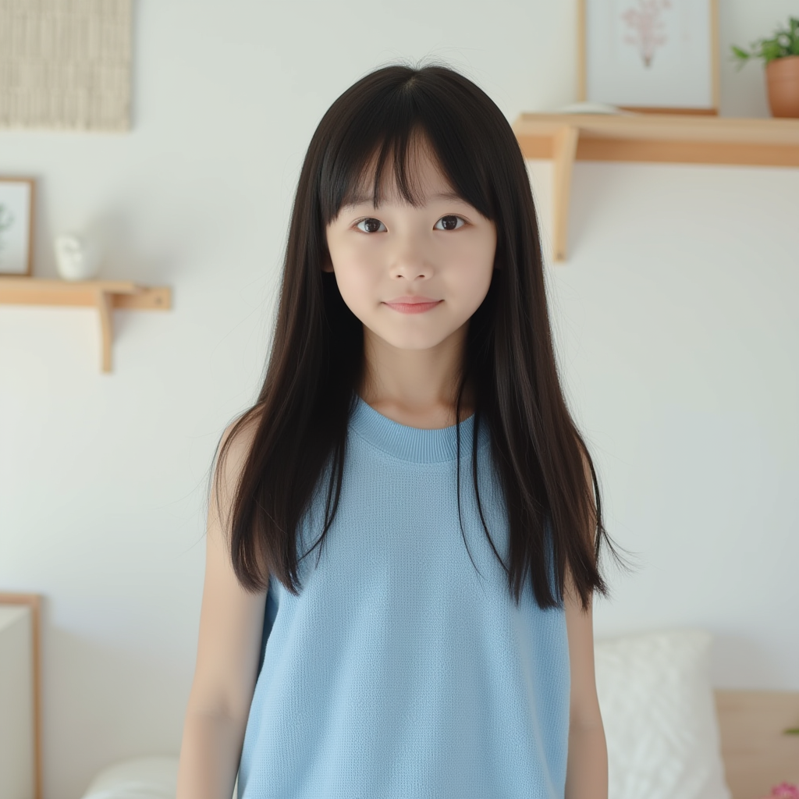
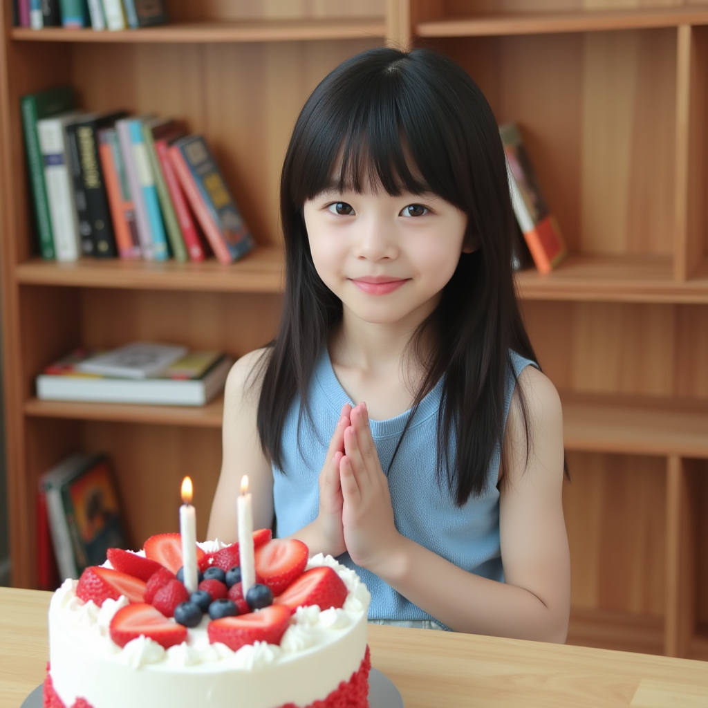
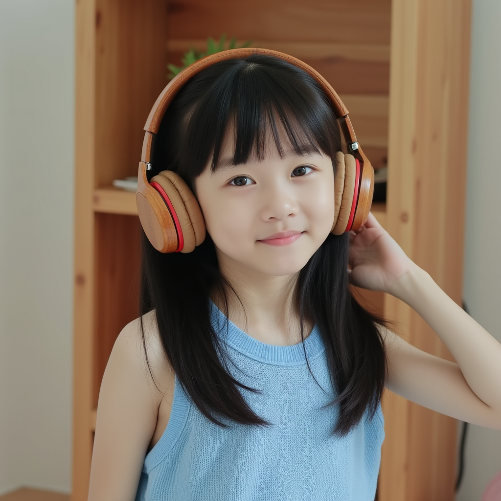
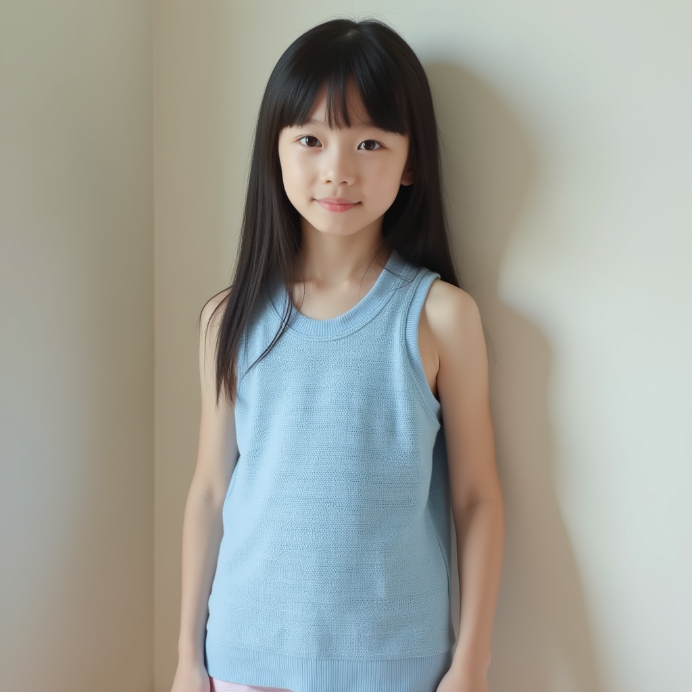
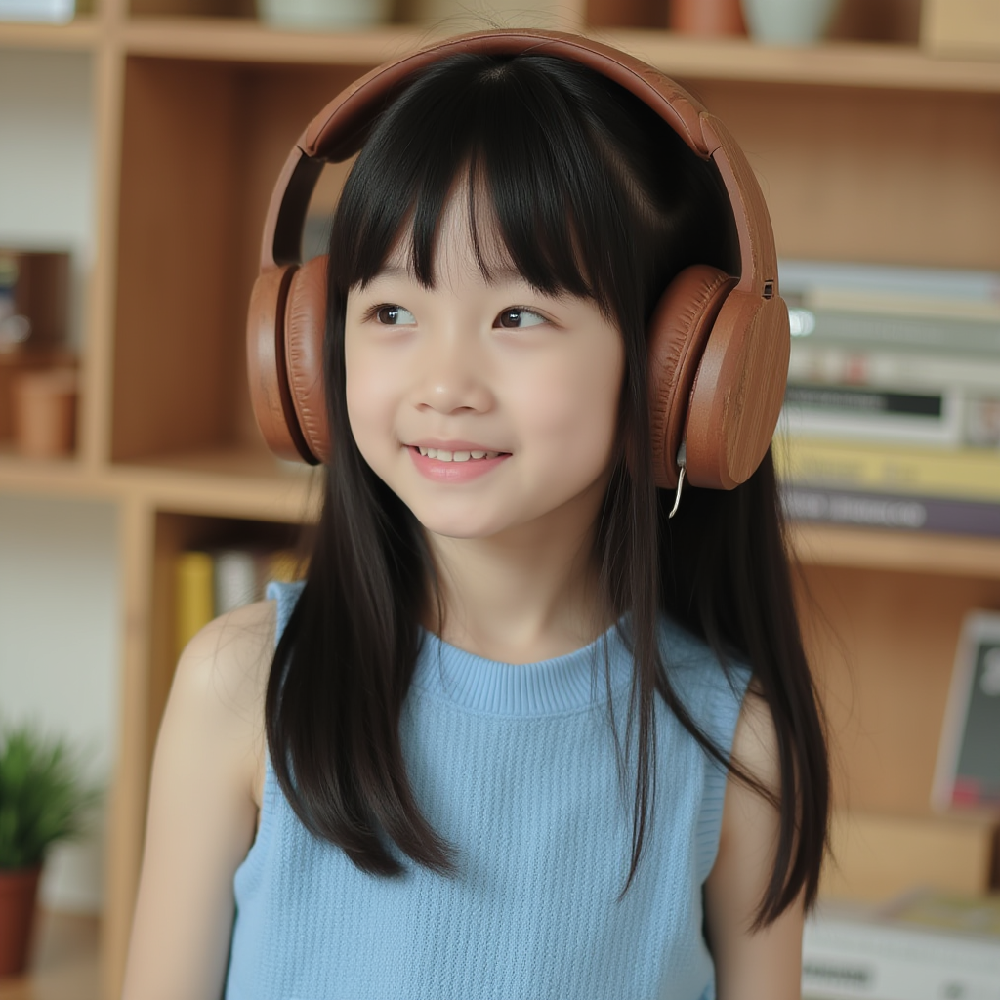
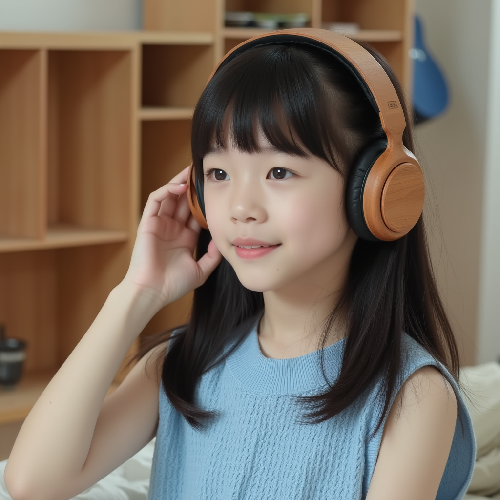
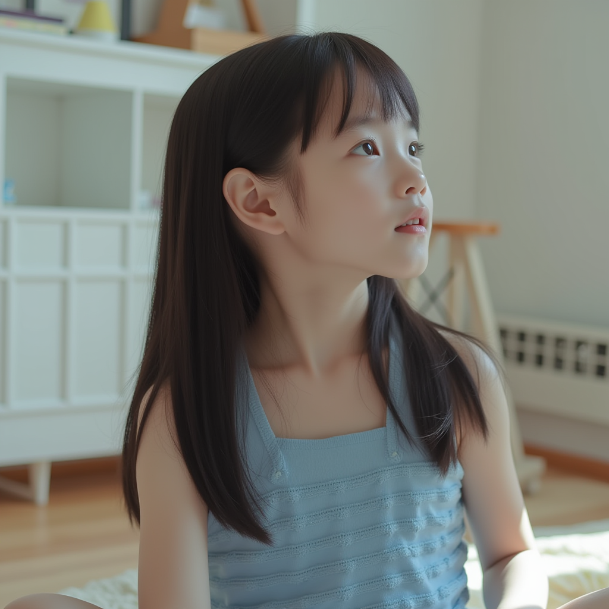
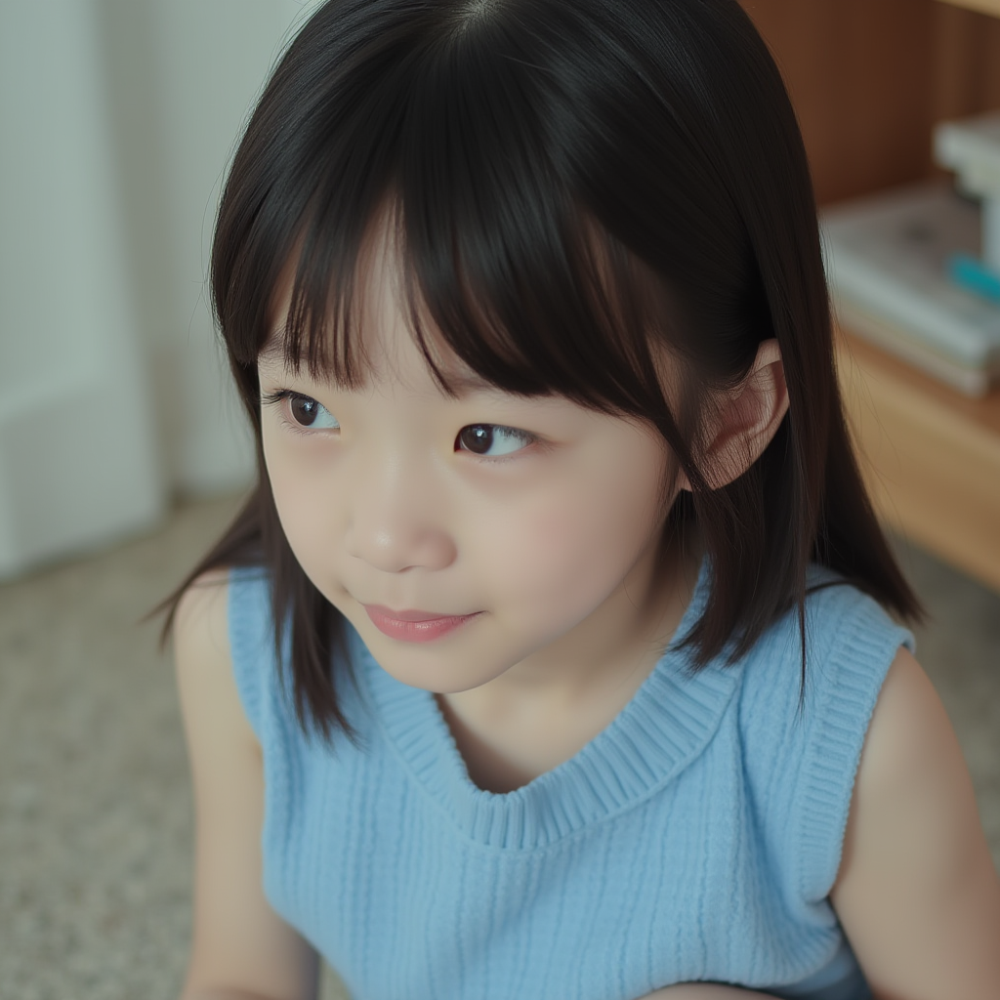

# AI-Daughter (AI 女儿)

## 一句话说明

该项目是一个叫“AI女儿”的**角色扮演**AI智能体（AI Agent），通过输入“图片+文字”输出“**具有角色一致性**的图片+文字”与用户交互，通过“OpenAI API”兼容的API实现LLM、VLM模型调用，图生图与文生图使用了“百炼大模型”、“魔塔社区”平台。

更多内容可以看项目内`/old/提示词.md`文件，里面涵盖了从需求背景->设计->开发的完整思路。

## 以图生图参考图预览

### 主要图片

| 01 | 02 | 03 | 04 |
|----|----|----|----|
|  |  |  |  |

| 05 | 06 | 07 | 08 |
|----|----|----|----|
|  |  |  |  |

| 09 | 10 | 11 | 12 |
|----|----|----|----|
|  |  |  |  |

| 13 | 14 | 15 | 16 |
|----|----|----|----|
|  |  |  |  |

| 17 | 18 |  |  |
|----|----|----|----|
|  |  |  |  |

### 变体图片（带后缀）

| 03-02 | 04-02 | 05-02 | 07-02 |
|-------|-------|-------|-------|
|  |  |  |  |

| 08-02 | 09-02 | 09-03 | 11-02 |
|-------|-------|-------|-------|
|  |  |  |  |

| 14-02 | 14-03 | 14-04 | 15-02 |
|-------|-------|-------|-------|
|  |  |  |  |

| 16-02 | 16-03 | 18-02 |  |
|-------|-------|-------|-------|
|  |  |  |  |

## 技术架构

项目采用前后端分离的架构设计：

- 前端 (`aife-daughter-frontend/`): 用户交互界面
- 后端 (`app/`): 核心业务逻辑处理
- 数据管理 (`data/`): 存储交互数据和系统配置
- 图像处理 (`image_json_agent.py`): 这是一个基于“以图生图参考图”生成图片描述json的辅助脚本
- 系统配置 (`settings.json`): 全局配置管理，一些AI女儿的配置
- 提示词系统 (`提示词.md`): 写这个项目时我使用了gpt5-high，这是与它交流的第一个提示词。显然你还可以在项目中看到一些琐碎的提示词，往往是这个提示词的旧版或者在新上下文中的补充，看这个就可以了。

## 功能特点

- 多会话角色扮演，有1个女儿+N个npc
- 时间线服务，用于：
    + 创建npc
    + 控制女儿、玩家、npc进入/离开某个会话
    + 产生和控制剧情走向
    + 制造条件，引导女儿与玩家交互
- 基于以图生图的，具有一致性的角色图片生成，使用大量参考图模板，生成时则其一，以优化泛化和效果。相比flux-lora，无需抽卡，**一次就好，这是通过生成图片与玩家交互的技术前提**。
- 称谓系统，通过我喊（称呼）你什么，你喊我什么，增强沉浸感。还引导玩家使用称谓与女儿或者npc交互。
- 支持用户对女儿和玩家命名
- 多智能体编排，尝试使用中等能力模型的实现功能

## 环境要求

- nodejs稳定版
- python3
- npm

## 快速开始

1. 克隆项目
```bash
git clone https://github.com/Deng-Xian-Sheng/AI-Daughter.git
cd AI-Daughter
```

2. 安装依赖

创建虚拟环境

```bash
python3 -m venv venv
source ./venv/bin/activate # Linux
```

安装pip包

```bash
pip install -r requirements.txt
```

安装前端包
```bash
cd aife-daughter-frontend
npm install
```

3. 启动服务
```bash
# 启动后端服务
cd app
MODELSCOPE_API_KEY="you key by 魔塔社区"  DASHSCOPE_API_KEY="you key 这个不是必填，除非你使用百炼大模型平台" uvicorn app.main:app --reload

# 启动前端服务（新终端）
cd aife-daughter-frontend
npm install # 如果没装过
npm run dev
```

## 使用指南

1. 访问系统前端界面
2. 开始与AI女儿互动

## 清理运行产生的文件

使用 `clear.sh` 脚本：
```bash
./clear.sh
```

它会**删除所有会话、生成的图片、上传的图片**，别误删

## 许可证

本项目采用 LICENSE 文件中规定的GNU3许可证

## 贡献指南

欢迎贡献，不要想，让别人做什么，要想，自己能做什么。（除非你向我付钱，一大笔钱）

## 联系方式

如有问题，欢迎通过以下方式联系：

- GitHub Issues
- 没了没了，实在不行加我QQ，你绝对能找到我QQ

## 致谢

感谢所有对项目发展做出贡献的开发者和用户。

特别是OpenAI，它的gpt5-high真的帮助了我很多。

以及免费提供LLM、VLM、文生图、以图生图API的**魔塔社区**，太感谢了，没有它就没有这个项目！

还有提供思路和允许我唠叨的哪些人，三人行必有我师🎉

## 开发进度

**进行中/待关注清单（To-Do）**
- 后端：自动 img2img 优先链路（若本轮需要“女儿/卧室/她/房间”等）
  - 文件：app/services/chat_orchestrator.py → handle_user_message 尾部“图像决定与任务”分支
  - 依赖：
    - app/services/ref_selector.py（select_reference）
    - app/services/ref_registry.py（register_ref_image）
    - app/services/prompt_writer.py（build_img2img_edit_prompt）
  - 目标：若匹配则走 img2img（Qwen-Image-Edit）；否则 text2img
  - 备注：已给出补丁（自动读取 /data/refs/*.json），需要确认是否合并
- SSE 断线自动重连（前端）
  - 文件：src/stores/sessions.ts → connectSSE
  - 目标：指数退避重连；onerror/readyState=2 时重连；重连后拉取最新 messages
- 生成失败（gen_error）支持“一键重试”
  - 前端：MessageBubble.vue（错误占位增加“重试”按钮，触发相同 prompt 再发）
  - 后端：image_service.run_image_task 可接受 retry 标记；chat_orchestrator 在 image_task_done:FAILED 场景记录最近一次 prompt/params
- 设置面板：动画参数/宽度参数可视化调节（即时生效）
  - 前端：新增 SettingsPanel；用 CSS 变量驱动（--gen-pan, --gen-blob-move, --gen-blob-blur, --gen-sat, --gen-ctr, --bubble-max-text, --bubble-max-image）
  - 持久化：pinia → localStorage（即可）
- 称谓编辑器
  - 前端：MessageBubble 头部加入“编辑称谓”铅笔 → 弹框；调用 /api/relationship.set
  - 后端：app/routers/relationships.py（已有）；sync entities store
- 多会话红点/引导跳转
  - 前端：src/stores/sessions.ts 维护每会话 unread_count；SSE 收到非当前会话消息时 +1
  - UI：SessionTabs 红点/高亮；时间线建议进入会话时软跳转
- NPC 创建与头像
  - 时间线触发：app/services/timeline_engine.py → beats 中 npc_spawn
  - 后端：app/services/npc_service.py（create_npc 已有）→ 生成头像 → 注册到 npcs.json
  - 前端：会话/消息头部显示 NPC 头像与名牌
- VLM 增量重解析策略
  - 文件：app/services/vision_service.py
  - 规则：当用户提到的新关键词不在 summary.tags/objects/actions 时，对该图触发“补充解析”；summary 合并
- 文本上下文摘要与 Token 控制
  - 文件：app/services/chat_orchestrator.py
  - 计划：每N轮对话自动生成会话摘要（短摘要），MAX_CONTEXT 保持 10-12；图片仅传摘要
- 日志与指标
  - 后端：调用耗时、失败率（images/vlm/llm）、任务队列长度
  - 位置：/logs 或控制台 + 简单仪表页
- 移动端适配（暂缓）
  - 宽度断点：tabs-panel 收起，底部工具条收纳；图片 Lightbox 手势（双击缩放/拖拽）

**已完成/已修复/已优化**
- SSE 流式文本输出（分片）
  - 文件：app/services/chat_orchestrator.py
  - 事件：text_start → text_delta → text_done；最终写库，不再重复 message_new 文本
  - 流式空片回退：无分片则走非流式一次取全量
- 图片生成任务流
  - 后端完成后落库图片消息（append_message "image"）
  - SSE：image_task_queued（前端插入“生成中占位”）→ message_new（agent/generated，替换占位）→ image_task_done（前端忽略或失败标记）
  - 文件：
    - app/services/image_service.py（任务/落地）
    - app/services/chat_orchestrator.py（_watch_and_publish_task）
- 元信息标记与前端展示去重
  - meta.kind：uploads | generated | loading | gen_error
  - 前端按 kind 决定路径（uploads/generated）与占位渲染，不再重复图片气泡
- 图片上传（乐观预览）
  - 托盘：选择即显示缩略图，可删除；发送后“上传中…”，SSE 返回后移出托盘并在消息区展示
  - 文件：
    - src/stores/sessions.ts（pending[], uploadQueue[]，对齐 FIFO）
    - src/components/ChatWindow.vue（attach-tray UI）
- 文字气泡宽度异常修复
  - 规则：文字泡 inline-block 自适应；图片泡与占位 100% 占满
  - 容器：仅当本行含图片泡时拉满 .bubble-wrap（:has(.bubble.image) 或 .msg-row.image）
  - 文件：index.html（CSS）
- 生成中占位大小与动画
  - 统一与图片泡同宽的正方形（aspect-ratio:1/1）
  - 背景基底流动（bgPan=4s）+ 两团色块云漂移（blobA/blobB，位移/旋转/呼吸），CSS 变量可调
  - 文件：index.html（CSS，.img-gen-skeleton）
- Lightbox（全屏查看 + 下载）
  - 过渡：遮罩淡入、图片轻浮缩放
  - 下载：fetch→blob→ObjectURL 触发保存（跨端口可用），按钮统一字号、无下划线
  - 文件：src/components/ImageLightbox.vue, src/stores/ui.ts；App.vue 挂载组件
- “正在输入…”恢复
  - 流式 text_start 初始文案“正在输入…”，收到第一段 delta 清空再拼接
  - 文件：src/stores/sessions.ts（text_start/delta/done 分支）
- 初次加载输入区定位/滚动
  - chat-body → Flex 纵向；main-area → Flex 横向；messages → flex:1 min-height:0；composer → grid 双列（托盘一行占满）
  - 文件：index.html（CSS）
- 时间线初始化
  - 刷新后也显示当前时间线（/api/timeline.slice）
  - 文件：src/api.ts（getTimelineSlice），src/stores/sessions.ts（bootstrap 时拉取）
- 背景几何图恢复
  - 轻量 shape 漂浮（spawnShapes in main.ts），尊重 prefers-reduced-motion
  - 文件：src/main.ts（spawnShapes），index.html（.shape CSS）
- 乱码与 form-data 兼容
  - 发送 JSON 或 multipart/form-data（files 字段）；x-www-form-urlencoded 需 charset=utf-8
  - 新接口 message.send.json 已撤销，统一使用 form-data

**当前代码关键点与位置索引（便于回忆）**
- 后端
  - app/main.py（路由挂载、静态资源 /static/images）
  - app/config.py（Settings，model_config protected_namespaces修复；paths）
  - Routers：
    - /api/session.create（对象 body），/api/session.list，/api/session/{id}/messages，/api/message.send（form-data）
    - /api/stream/{session_id}（SSE）
    - /api/image.generate（任务），/api/tasks/{task_id}
    - /api/image.describe（VLM），/api/settings（get/post）
    - /api/timeline.slice, /api/timeline.tick
    - /api/relationship.set，/api/npc.create，/api/ref.register
  - Providers：
    - app/providers/llm_vlm.py（OpenAI兼容，ModelScope/百炼）
    - app/providers/images_modelscope.py（/v1/images/generations 异步 + /v1/tasks 轮询）
    - app/providers/images_bailian.py（generation 同步；base64/URL输入）
  - Services：
    - chat_orchestrator.py（SSE流式；_need_image；_watch_and_publish_task；安全回退）
    - image_service.py（run_image_task；任务表 TASKS；下载落地）
    - vision_service.py（_extract_json 解析 ```json 块；缓存 /data/image_meta）
    - ref_selector.py（LLM 选参考图）
    - ref_registry.py（参考图复制到 uploads → image_id）
    - prompt_writer.py（text2img/img2img/avatar 模板；NEGATIVE_COMMON；decide_size）
    - memory_store.py（sessions_index.json、messages.json、npcs.json 等）
    - sse_hub.py（每会话 pub/sub）
    - timeline_engine.py（时间片推进、beats）
    - relationships.py / npc_service.py
- 前端
  - 入口与状态：
    - src/main.ts（spawnShapes）
    - src/api.ts（API_BASE；getTimelineSlice）
    - src/stores/sessions.ts（SSE事件全流程；pending/uploadQueue/genLoaders；imageUrl；bootstrap）
    - src/stores/ui.ts（Lightbox）
    - src/stores/settings.ts / src/stores/entities.ts（称谓映射）
  - 组件：
    - App.vue（挂载 ImageLightbox）
    - HeaderBar.vue / TimelineBar.vue / SessionTabs.vue
    - ChatWindow.vue（messages 列表；composer grid；attach-tray）
    - MessageBubble.vue（rowTypeClass or :has；isGenLoading/isGenError；img-gen-skeleton + loader Icon）
    - ImageLightbox.vue（过渡与下载）
  - 样式主轴（index.html 内联 CSS）：
    - 变量：--bubble-max-text, --bubble-max-image；生成占位参数（--gen-pan, --gen-blob-move, --gen-blob-blur, --gen-sat, --gen-ctr）
    - 布局：chat-card, chat-body, main-area, tabs-panel, chat-window, messages, composer（grid）、attach-tray
    - 气泡：文字 inline-block，自适应；图片/占位 100%
    - 占位：.img-gen-skeleton + ::before/::after 色块云 + bgPan
    - 背景：.bg-layer + .shape 浮动几何

**配置与约束**
- settings.json（手工切换 provider/transport）
  - providers.llm/vlm/text2img/img2img：modelscope | bailian
  - image_transport.modelscope：data_uri | public_url
  - 生产：CDN/Frp 外网 URL 与 /static/images 路径拼接
- 环境变量：MODELSCOPE_API_KEY, DASHSCOPE_API_KEY
- 模型：
  - LLM：Qwen3-235B-A22B-Instruct-2507（OpenAI兼容，ModelScope or Bailian）
  - VLM：Qwen2.5-VL-72B-Instruct（结构化摘要）
  - 文生图：Qwen-Image（异步）
  - 图编：Qwen-Image-Edit（img2img）
- 数据目录（开发期落文件）
  - /data/images/uploads, /data/images/generated, /data/images/refs
  - /data/refs/*.json（参考图元信息）
  - /data/image_meta/*.json（VLM摘要）
  - /data/sessions/{id}/messages.json，/data/sessions_index.json
  - /data/users.json, /data/agents.json, /data/npcs.json, /data/relationships.json, /data/timeline.json

**风险与注意点**
- CSS :has 选择器兼容性：现代 Chrome/Edge/Safari OK；若需旧版，保留 .msg-row.image 方案
- 任务对齐：uploadQueue / genLoaders 队列与 SSE 顺序一致；异常时 fallback append
- VLM 成本：只在必要时调用；有缓存与增量重解析
- 图片频控：每会话每 10 分钟最多 N 张（settings.limits.images_per_session_per_10min）
- 安全与过滤：NEGATIVE_COMMON 已覆盖；对话中避免不当内容（系统提示）

**可后续考虑的“加分项”**
- Lightbox 手势（双击缩放/滚轮缩放/拖拽/左右切换上一张下一张）
- 图片消息“另存为参考图”→ 写 refs JSON，辅助后续 img2img
- 图像提示词失败自动“负向词强化”与参数自适配（步数/CFG）
- 任务中心小面板（展示排队/进行中/失败）
- UI 主题（暗色/浅色），动画强度开关